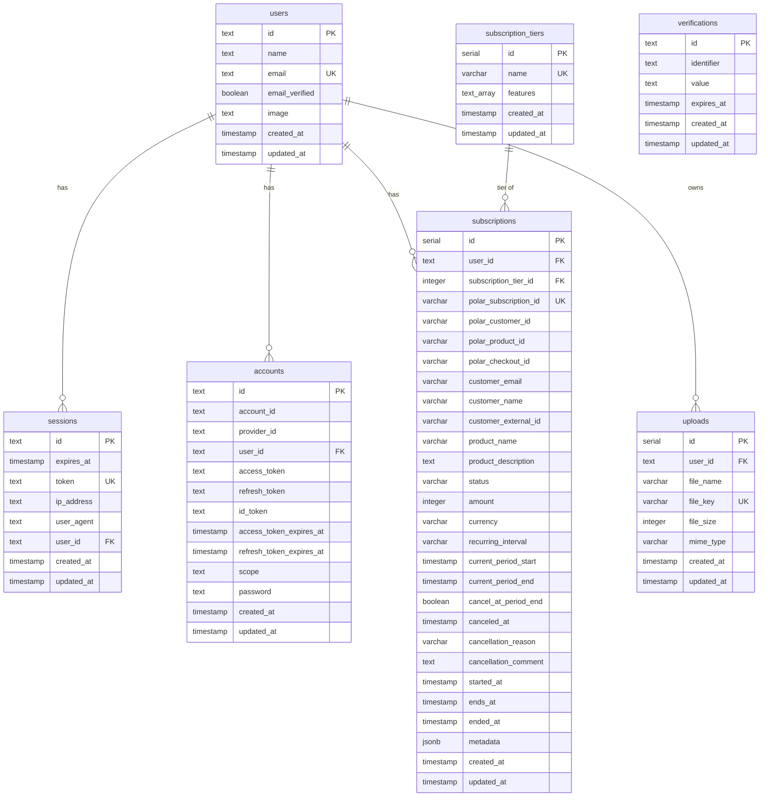

# Database model

> Update this file in a separate commit whenever the database schema changes.
> Run `bun run db:doc` to regenerate the mermaid skeleton from the current
> `src/lib/db/schema.ts`.

## ER diagram

## Tables

### `users`

The application's identity table, owned by BetterAuth. Holds the public profile fields (name, email, image) plus the email-verification flag. Every other domain table that belongs to a user references `users.id` with `ON DELETE CASCADE` on the auth-internal tables and a plain reference elsewhere. New per-user features should add a `user_id text references users(id)` column.

### `sessions`

BetterAuth session storage. One row per active sign-in. The `token` is the cookie value; `expires_at` drives session expiry. `ip_address` and `user_agent` are recorded at creation for audit.

### `accounts`

BetterAuth credential store. Each row is one (provider, accountId) pair belonging to a user. For email/password the row carries the salted password hash in `password`; for any future OAuth provider it carries access/refresh tokens. `provider_id = 'credential'` for email/password.

### `verifications`

BetterAuth's short-lived token store: email-verification links, password-reset tokens, etc. `identifier` is the target (usually the email), `value` is the token, `expires_at` enforces the window.

### `subscription_tiers`

Internal catalog of feature bundles (`name` is unique). `features` is a Postgres `text[]` of feature flag strings the app reads to gate UI and endpoints. Subscriptions optionally reference a tier — Polar is the source of pricing/billing truth, but tier mapping lives here.

### `subscriptions`

Mirror of the user's Polar subscription state. Polar webhooks (`/api/webhooks/polar`) write to this table on `subscription.created`, `subscription.active`, `subscription.updated`, and `subscription.revoked`. The columns split into Polar identity (`polar_*`), denormalized customer/product display fields, billing state (`status`, `amount`, `currency`, `recurring_interval`, `current_period_*`), and cancellation metadata. The app reads `subscriptions` for entitlement decisions instead of calling Polar at request time.

### `uploads`

Index of files stored in Cloudflare R2. `file_key` is the canonical R2 object key (unique). `file_size` and `mime_type` are recorded at presign time and validated at the `/api/uploads/complete` step. View/download endpoints look up by `id`, verify `user_id` ownership, and return short-lived presigned GET URLs.
